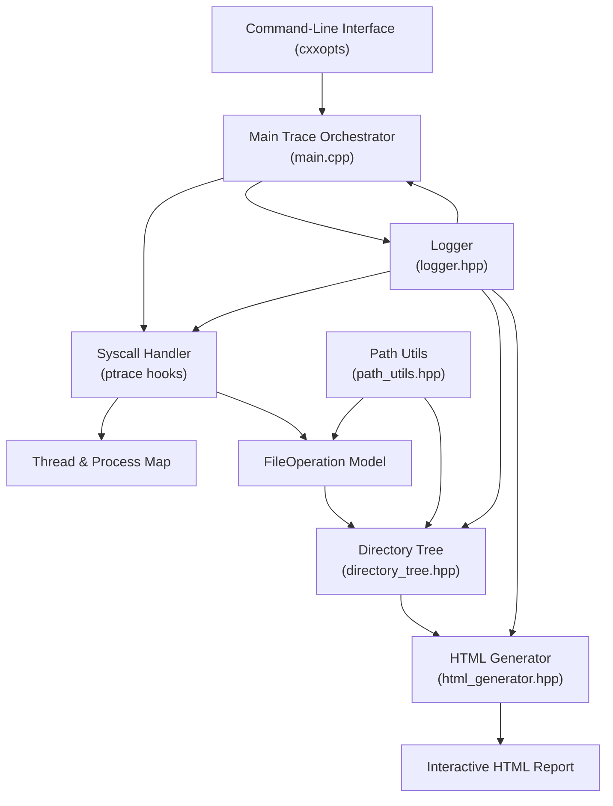
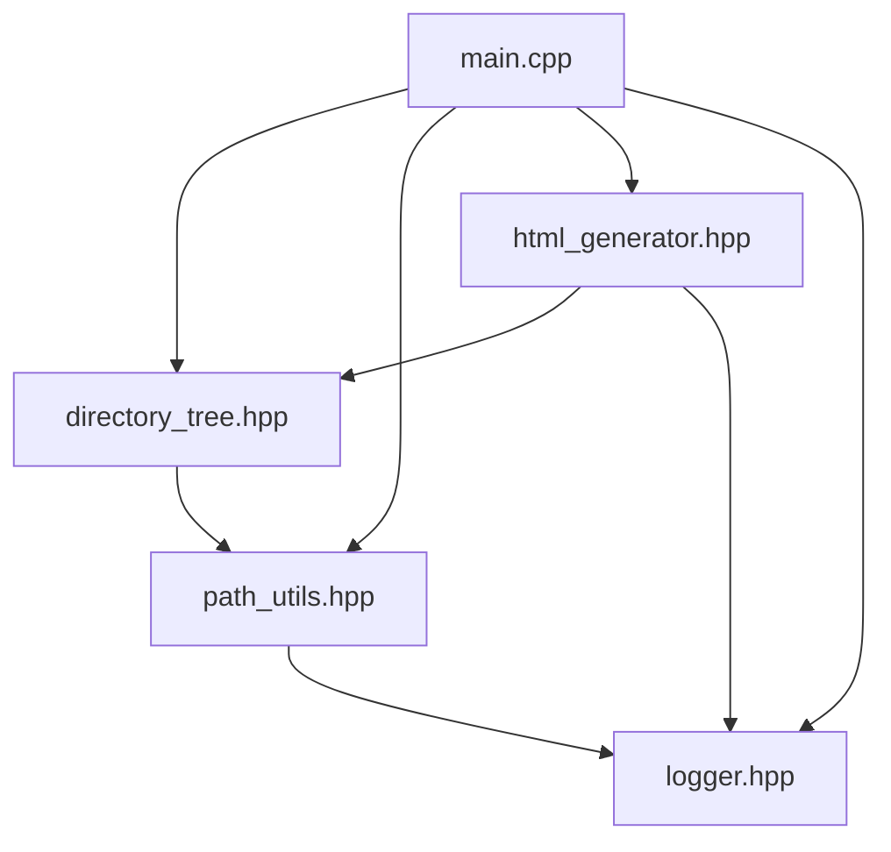

# FileTrace Architecture Documentation

## Overview

FileTrace is a thread-aware file access visualization tool designed to monitor, analyze, and visualize file operations across Linux processes and threads. The system traces process creation (via fork, vfork, clone), tracks individual thread and process file accesses, and generates an interactive HTML visualization. The tool is written in modern C++ (C++17) and is designed for extensibility and robust concurrent process handling.

## High-Level Architecture

The project is composed of several tightly integrated modules, each responsible for a core aspect of tracing, analysis, or visualization:

- **Main Trace Orchestrator (`main.cpp`)**: Entry point responsible for parsing CLI options, forking/tracing a process, intercepting system calls (via `ptrace`), and collecting file operation events.
- **Directory Tree Model (`directory_tree.hpp`)**: Maintains an in-memory hierarchical model of all file accesses, mapped to sequences, process/thread IDs, and names. This structure is later visualized.
- **HTML Report Generator (`html_generator.hpp`)**: Converts the directory tree and associated metadata into an interactive, styled HTML report with JavaScript and CSS for visualization.
- **Path Utilities (`path_utils.hpp`)**: Provides robust path normalization, directory filtering, and symlink resolution for correct file operation attribution.
- **Logging Facility (`logger.hpp`)**: Thread-safe logging (with fine-grained log levels) to assist debugging, event inspection, and trace reproducibility.

## Container and Build Structure

FileTrace is a C++ executable built using CMake. The core code resides in `src/`, tests in `tests/`, and build instructions are encapsulated within `CMakeLists.txt`. Key third-party dependencies—such as `cxxopts` (for CLI parsing) and GoogleTest (for unit tests)—are fetched automatically during build configuration.

- **Executable Target**: `filetrace` (built from `src/main.cpp`)
- **Dependencies**: cxxopts, GoogleTest (testing only)
- **Build System**: CMake (min. 3.15), GCC 8+/Clang 7+

## Process Flow and Component Relationships

When the tool is invoked (via CLI), the following pipeline is established:

1. **Parse Options**: Using `cxxopts`, parse command line arguments (such as output file, directory filters, and command to trace).
2. **Process Forking & Tracing**: The target command is forked and run under `ptrace`, allowing FileTrace to intercept and react to all process/thread creations and file-related syscalls.
3. **Thread/Process Tracking**: All new processes and threads are tracked with metadata (PID, parents, names, creation/termination, child relationships).
4. **File Operation Interception**: System calls (`open`, `openat`, `execve`) are intercepted. File paths are normalized, filtered if needed, and attached to the thread/process in a central directory tree.
5. **Event Model Update**: Each detected file operation is inserted into the directory tree, tagged with sequence numbers and thread/process context.
6. **Visualization Output**: At the end of tracing, the collected tree is serialized visually to an HTML file, producing an explorable, filterable chart of access events.

### Component Interaction Diagram

## Interfaces and Dependencies

- **Input Interface**: Command-line arguments specify the process to trace, output location, and tracing mode.
- **Core C++ API/Classes**:
  - `DirectoryTree`, `DirectoryNode`: Manages the in-memory hierarchy of file accesses.
  - `HtmlGenerator`: Translates tree model into styled HTML/JS.
  - `Logger`: Thread-safe, multi-level logging for event tracing and debugging.
  - `path_utils`: Static methods for robust path handling.
  - Various structs: `ThreadInfo`, `FileOperation` for modeling trace metadata.
- **System Interfaces**: Employs Linux-specific APIs—`ptrace`, `waitpid`, `/proc`—requiring Linux OS.

## Design Rationale and Strengths

- **Thread Awareness**: Uniquely maps all file operations to the specific OS thread/process responsible, even in highly concurrent scenarios.
- **Hierarchical Event Model**: File operations are visualized in a directory-tree structure, reflecting both the file system and execution context.
- **Extensibility**: Components organized for easy extension with new event types, filtering strategies, or visualization improvements.
- **Rich HTML Reports**: Interactive output designed with usability, filterability, and detail in mind.

## Project Files Overview

- `src/main.cpp` — Orchestrates the entire tracing and visualization flow.
- `src/directory_tree.hpp` — Models file/process/file system hierarchy as a tree.
- `src/html_generator.hpp` — Outputs the visualization.
- `src/path_utils.hpp` — Path normalization and filtering helpers.
- `src/logger.hpp` — Thread-safe logging implementation.
- `CMakeLists.txt` — Build configuration and dependency specification.
- `README.md` — High-level project, usage, and feature overview.

---

## Component Dependency Diagram

## Summary

FileTrace is a robust, extensible solution for capturing and visualizing file access behaviors across complex, multi-threaded Linux environments. Its modular design, rich event tracking, and interactive visual output make it highly suitable for debugging, security auditing, or educational uses. The codebase puts heavy emphasis on correctness, debuggability, and clarity of architectural boundaries.

